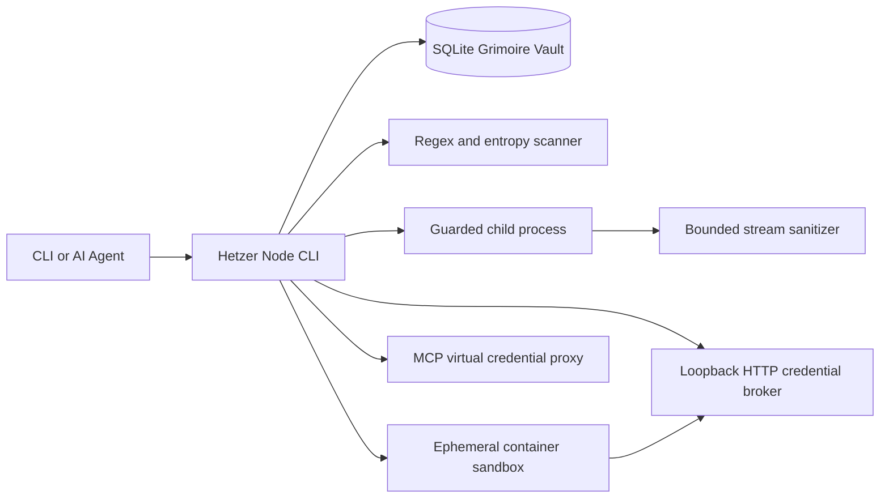

# Hetzer architecture

Hetzer's core runtime consists of the Node CLI, Grimoire vault, secret scanner, MCP credential proxy, and ephemeral container sandbox. Multi-container operations and stack management are delegated to [Jagdpanzer](https://github.com/agunggnn/jagdpanzer).

## Main components

The package declares no third-party runtime npm dependencies. It depends on Node.js and its standard modules, including `node:sqlite`, `node:crypto`, `node:fs`, and `node:child_process`. Optional services have their own container dependency trees.

## Grimoire vault

Vault metadata is stored in SQLite. Credential values are encrypted separately using AES-256-GCM. Each encryption uses a random 12-byte IV, an authentication tag, and additional authenticated data bound to the credential identifier and creation time. The master key is normalized and expanded with HKDF-SHA-256.

The master key is resolved with deterministic precedence: explicit runtime environment (`HETZER_GRIMOIRE_KEY`), followed by local workspace `.env` configuration, falling back to the user-level isolated file (`~/.hetzer/grimoire.key`). `hetzer creds isolate-key` moves a workspace key into the user-level file and requests POSIX mode `0600` (along with Windows DACL hardening). This separates the key from the workspace to prevent automated agent file-reads; it does not protect against the same OS user executing arbitrary commands outside a container sandbox.

Credential records can restrict target and action. `secretRef:<id>` resolution checks the target, allowed action, validity, and expiry before decryption. Internal decryption is decoupled into private `#decryptRaw`, capability-scoped `resolve()`, non-revealing equality `matchesSecret()`, and human-guarded `reveal()`.

## Scanner

`scanText` scans explicit input for:

- selected npm, OpenAI, Anthropic, Gemini, GitHub, Slack, AWS, and JWT formats;
- credentialed PostgreSQL, MySQL, MongoDB, and Redis URLs;
- PKCS#8 and algorithm-prefixed PEM private-key blocks up to 16 KiB;
- high-entropy candidates from 24 to 512 characters with Shannon entropy of at least 4.3 bits per character.

Specific matches take priority over overlapping generic entropy matches. These heuristics can miss unsupported, encoded, split-across-files, unusually long, or transformed values and can flag benign data.

`redactAndVault` always removes detected values from returned text. It reports `vaultedCount`, per-item `vaulted` status, and `vaultErrors`. If the provider's default credential ID already contains a different value, a hash-suffixed ID is allocated instead of overwriting the existing credential.

## Guarded process execution

`hetzer exec` selects reference bindings only through `--allow`. If `.hetzer/brokers/<credential-id>.json` exists, Hetzer starts that reviewed HTTP broker policy and gives the child its loopback base URL and short-lived capability instead of the credential. A compatible policy can also be supplied with `--broker-policy`. Credentials without a broker policy fail closed unless the same ID is explicitly listed in `--allow-raw-unmediated`; that opt-out is audited and, when an execution policy is active, must be permitted by `allowRawUnmediated`. With `--strict`, the child starts from a small cross-platform environment allowlist; the vault master key is not inherited.

Execution policy manifests (`--policy`) enforce exact structured `argv` matching rather than loose prefix string matching, preventing command chaining or trailing argument bypasses. Any shell metacharacters (`&`, `|`, `;`, `<`, `>`, `$`, `` ` ``, `\n`, `\r`, `%`, `^`) in commands or arguments are rejected upfront. Child processes execute with `shell: false` across all platforms (with Windows npm/npx safely resolved directly to their underlying node entrypoints), eliminating shell interpretation and argument injection vulnerabilities. Policy files are treated as trust roots and undergo regular-file verification, POSIX permission checks, and SHA-256 integrity auditing.

Common environment-reflection command strings are rejected before spawn. This is a misuse safeguard, not a sandbox: equivalent code, native binaries, debuggers, encodings, and external side effects remain possible inside an authorized child.

Guarded child and Docker Compose stdout/stderr pass through independent UTF-8 rolling sanitizers. Each retains `max(128, longest injected secret × 2)` characters and scans a bounded 512-character lexical window. Before emission, a streaming filter removes terminal control/format characters and suppresses supported private-key blocks, credentialed database URLs, and provider-token candidates without waiting for a fixed 16 KiB window. Known injected values are detected even when writes split them across chunks. Deliberately transformed values, unsupported formats, non-UTF-8 output, and output written directly to a terminal device, file, or network remain outside this filter.

## HTTP credential broker

`hetzer broker` and mediated `hetzer exec` start short-lived listeners on `127.0.0.1` and launch compatible HTTP clients with random capabilities instead of selected vault credentials. A versioned policy fixes the HTTPS upstream origin, client and upstream authentication headers, allowed methods and path prefixes, environment variable names, request limits, and lifetime. The broker replaces a capability with its resolved credential only on an allowed upstream request.

Broker v1 blocks redirects, binary responses, over-limit bodies, non-loopback clients, matrix parameters (`;`), and unsupported methods or paths. Fixed-point path canonicalization eliminates nested percent-encoding and directory traversal attacks. It sanitizes the exact credential from supported upstream responses and child output. It is not transparent process or network containment: the child may open unrelated connections, and same-user access to the policy, key, vault, or broker process remains outside this boundary. See [HTTP credential broker](http-credential-broker.md).

## Credential reveal, same-user agentic guard, and canaries
 
Credential revelation (`hetzer creds reveal` and programmatic `Grimoire.reveal()`) enforces `assertInteractiveHumanSession()`: requiring a direct interactive TTY, rejecting known agent environment markers, and inspecting process ancestry trees (with in-process sub-millisecond caching) on Windows, macOS, and Linux. This blocks same-user autonomous agents from dumping plaintext credentials while preserving non-interactive runner and broker execution via decoupled `Grimoire.resolve()`. A native modal confirmation is also enforced on CLI execution. These provide defense-in-depth safeguards rather than an impenetrable OS privilege barrier.
 
Canary IDs are checked by guarded vault reveal and reference-resolution paths. A hit logs an incident, attempts an SQLite audit record, throws `ERR_CANARY_TRIPWIRE_TRIGGERED`, and maps to CLI exit code 43. Arbitrary reads of vault, key, environment, process memory, or incident files are not monitored by the canary.

## MCP boundary

The MCP server exposes credential existence and metadata listing but no plaintext reveal tool. Tool results and errors are serialized and scanned before return. This protects the Hetzer MCP response path only; an MCP client may have other tools with broader access.

## Git guard

The pre-commit hook invokes Git to list staged files and obtain the added diff. It blocks staged `.env` variants and scans added text grouped by file, which allows multiline private-key detection and line reporting. Hook time includes Git process startup and varies with repository size. Local hooks can be bypassed, so enforced environments should add server-side scanning.

## Ephemeral container sandbox vs. multi-container stack orchestration
 
Hetzer focuses on single-command, ephemeral process containment via `hetzer exec --sandbox [image]`. Untrusted agent executions are isolated inside transient containers with `--cap-drop=ALL`, `--security-opt=no-new-privileges`, and strict process limits, while bridging the host loopback HTTP broker via `host.docker.internal`.
 
Multi-container full-stack operations (such as 9Router AI gateways, PostgreSQL/pgvector memory clusters, and cognitive extractors) are deprecated in the Hetzer core CLI and delegated to [Jagdpanzer](https://github.com/agunggnn/jagdpanzer), allowing Hetzer to maintain a clean, zero-dependency footprint strictly focused on credential safety and agent armor.

## Closed architecture proposals

- [RFC: Native OS Pinentry & GUI Masked Prompt Bridge](rfc-native-os-pinentry-bridge.md) — **Closed: Will Not Do.** The proposed agent-triggered GUI and loopback handoff does not provide a trustworthy same-user credential boundary.
