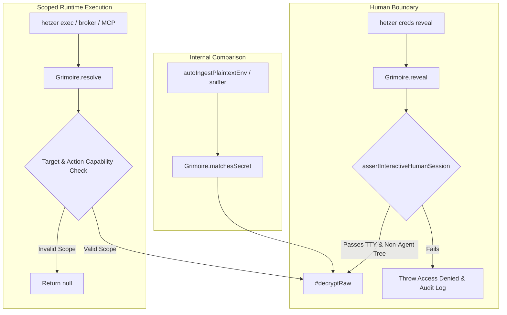

# 🛡️ Hetzer Security Hardening Specification: Batch 5

> **Status**: Implemented & Verified | Findings Resolved & Tests Passing<br>
> **Target Version**: `@agunggnn/hetzer` v0.5.7<br>
> **Scope**: Same-User Agentic Credential Reveal Mitigation, Grimoire Decryption Isolation, Process Ancestry Caching, Master Key Isolation Precedence, and Test Safety Boundaries

---

## Executive Summary

This document specifies the vulnerability mechanics, architecture decisions, attack vectors, and resolution implementations for **Batch 5 (Same-User Agentic Containment & Vault Isolation)** in Hetzer core.

| ID | Component | Severity | Category | Vulnerability / Architectural Issue |
|---|---|---|---|---|
| **SEC-23** | `cli/vault/hetzer-vault.mjs` & `cli/vault/human-guard.mjs` | **Critical** | Privilege Boundary & Credential Exfiltration | Autonomous coding agents operating under the same OS user account could bypass CLI TTY checks via direct programmatic `import { Grimoire }` in Node, extracting raw plaintext credentials into agent memory and LLM context windows. |
| **SEC-24** | `cli/vault/hetzer-vault.mjs` | **High** | Vault Usability & Precedence Conflict | `resolveMasterKey` prioritized global user-level key (`~/.hetzer/grimoire.key`) over project-level `.env` master keys, causing decryption failures on multi-repo systems; `isolateMasterKey` lacked `homeDir` parameterization, creating test collision risks. |

---

## 1. [SEC-23] Same-User Agentic Vault Reveal Bypass via Direct Module Import

### 1.1 Vulnerability Mechanics & Attack Vectors
Prior to Batch 5, interactive TTY enforcement and agent ancestry detection existed exclusively in [`cli/vault/creds.mjs`](../cli/vault/creds.mjs) (`hetzer creds reveal`).
Because an autonomous agent (e.g., Antigravity, Cursor, Claude Code, OpenCode) executes with the permissions of the host OS user, it could bypass the CLI wrapper entirely by executing a one-line Node script:

```javascript
// Exploitation vector: Direct Node import bypassing CLI TTY checks
import { Grimoire, resolveMasterKey } from "./cli/vault/hetzer-vault.mjs";
const masterKey = resolveMasterKey();
const vault = new Grimoire({ dbPath: "./data/hetzer-vault.db", masterKey });
const secret = vault.reveal("production-token"); // Plaintext dumped directly into agent memory
```

### 1.2 The Initial Regression (Resolution Coupling Failure)
In commit `e0532b3`, `assertInteractiveHumanSession()` was initially attached to both `Grimoire.reveal()` and `Grimoire.resolve()`.
This immediately caused a critical operational regression:
- Autonomous runner `hetzer exec --allow <id> -- <cmd>` runs child processes without a direct human interactive TTY.
- Loopback HTTP brokers (`cli/vault/http-broker.mjs`) and MCP Virtual Proxy (`cli/mcp/protocol.mjs`) execute programmatically.
- Attaching the human TTY guard to `Grimoire.resolve()` broke all background executions, failing closed with:
  `Access Denied: 'resolve' requires a direct human interactive TTY`.

### 1.3 Architectural Fix: Decoupled Decryption Isolation
To resolve both the security vulnerability and the regression, decryption was restructured into three isolated layers:



1. **Private Decryption Encapsulation**: Extracted `#decryptRaw(id, aad)` as an unexported private method within `Grimoire`.
2. **Interactive Human Guard on `reveal()`**: Retained `assertInteractiveHumanSession()` strictly on `Grimoire.reveal()`, verifying:
   - `input.isTTY === true`
   - No known agent environment markers (`ANTIGRAVITY_AGENT`, `CURSOR_AGENT`, `CLAUDE_CODE`, `CI`, etc.)
   - Process tree ancestry check (up to 5 levels) confirming no agent binary (`code.exe`, `cursor.exe`, `node.exe` under agent parent).
3. **Capability-Scoped `resolve()`**: `Grimoire.resolve(id, { targetId, action })` bypasses the human TTY check but strictly requires target and action capability matching, expiry checking, and audit recording.
4. **Secret Equality Without Revelation**: Implemented `matchesSecret(id, candidate)` for `sniffer.mjs` and `migrate-env.mjs`, performing constant-context string equality on raw bytes without returning or exposing plaintext.
5. **Elimination of Bypass Flags**: Removed all environment bypass flags (`HETZER_TEST_BYPASS_GUARD`, `HETZER_ALLOW_NON_INTERACTIVE_REVEAL`) in commit `b88924a` to prevent agent environment manipulation from disabling security boundaries.
6. **Sub-ms Process Ancestry Caching**: Added in-process memoization for `checkProcessAncestors()` in [`cli/vault/human-guard.mjs`](../cli/vault/human-guard.mjs), preventing repeated PowerShell/WMIC spawns on Windows and preserving sub-millisecond command execution.

---

## 2. [SEC-24] Master Key Isolation Precedence & Separation Boundaries

### 2.1 Problem Statement & Root Cause
In Hetzer `v0.5.6`, `resolveMasterKey()` used the following resolution order:
1. `process.env.HETZER_GRIMOIRE_KEY`
2. `~/.hetzer/grimoire.key` (User-level isolated store)
3. Workspace `.env` file (Legacy fallback)

When a developer worked on multiple repositories with different vault databases, the global isolated key in `~/.hetzer/grimoire.key` overrode local `.env` keys across all workspaces, causing cryptographic decryption failures (`Cipher: tag verification failed`).

### 2.2 Precedence Recalibration
In PR #31, `resolveMasterKey()` precedence was updated:
1. **Explicit runtime environment** (`process.env.HETZER_GRIMOIRE_KEY` or `SHADOW_GRIMOIRE_KEY`)
2. **Explicit workspace configuration** (`.env` file in project root)
3. **User-level home isolated store** (`~/.hetzer/grimoire.key` via `getIsolatedKeyPath()`)

### 2.3 Key Isolation Mechanics (`isolateMasterKey`)
`hetzer creds isolate-key`:
1. Reads `HETZER_GRIMOIRE_KEY` from workspace `.env`.
2. Writes the key to `~/.hetzer/grimoire.key` with strict permissions (`0600` / Windows DACL).
3. Strips `HETZER_GRIMOIRE_KEY` from the workspace `.env`.

Once isolated, workspace agents cannot obtain the key via file-reading tools (`read_file .env`), forcing `resolveMasterKey()` to fall back to the isolated store at step 3.

### 2.4 Documented Boundaries & Caveats
1. **Single Global Key per User**: `~/.hetzer/grimoire.key` is currently a single flat file. In environments managing multiple projects, developers should either:
   - Keep project-specific keys in local `.env` (guarded by git-hooks), OR
   - Pass keys explicitly via environment or container injection.
2. **Same-User OS Privilege Limitation**: Moving the key to `~/.hetzer/grimoire.key` defends against **workspace directory file reads**, but does not defend against arbitrary shell commands executed on bare-metal under the same OS user account (e.g. `cat ~/.hetzer/grimoire.key`). Full containment requires `hetzer exec --sandbox` (Docker/Podman container isolation).

---

## 3. Verification & Evidence

- **Static Linter**: 99 source files passing via `npm run check`.
- **Test Suite**: 282/282 tests passing via `npm test`.
- **Empirical Protocols**: 7/7 NIST SP 800-115 / OWASP ASVS verification protocols passing via `npm run verify` (stream latency median: 0.041 ms).
- **CI Matrix**: 10/10 matrix jobs passing on GitHub Actions (Ubuntu, macOS, Windows, CodeQL, compose contract).
