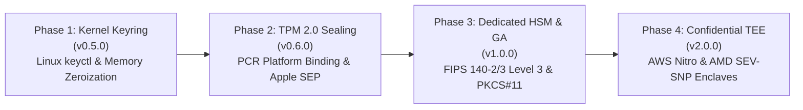

# Hardware Root of Trust Roadmap & Architecture Specification

> **Status**: Active Architecture & Roadmap Specification  
> **Current Baseline**: Hetzer v0.4.17 | 185 Passing Tests | 6/6 Empirical Protocols  
> **Target Milestones (not implemented in v0.4.17)**: v0.5.0 (Linux Keyring), v0.6.0 (TPM 2.0 Sealing), v1.0.0 (GA, Dedicated HSM & Cloud KMS), v2.0.0 (Confidential Computing / TEE)

---

## Executive Summary

Hetzer protects credentials in local AI agent workflows using a defense-in-depth architecture: SQLite Grimoire Vault encrypted with AES-256-GCM, sub-millisecond stream redactor, HTTP credential broker, and virtual MCP proxy.

While AES-256-GCM protects secrets at rest on disk, the master decryption key (`HETZER_GRIMOIRE_KEY`) and active secrets in transit must be held in system RAM during runtime. This specification defines Hetzer's hardware root of trust and memory isolation roadmap across four foundational hardware technologies:
1. **Platform Security Enclaves & TPM 2.0**: Device-bound identity, boot measurement (PCRs), and hardware key sealing.
2. **Confidential Computing / TEE (Trusted Execution Environments)**: Hardware-encrypted RAM isolating workloads from host roots, untrusted cloud hypervisors, and VPS providers.
3. **Dedicated HSM (Hardware Security Module) & Cloud KMS**: Non-exportable hardware key custody conforming to banking standards (FIPS 140-2/3 Level 3).
4. **Kernel-Space Key Management & Zeroization**: Linux Kernel Keyring (`keyctl`) reducing persistent/unmanaged user-space key storage; it does not eliminate plaintext in a process that must use the key.

### Current implementation boundary and multi-OS accuracy

This document is an architecture roadmap, not a claim that the hardware tiers already exist. In the v0.4.17 baseline, the runtime resolves `HETZER_GRIMOIRE_KEY` from the environment, an isolated user file, or the legacy `.env` path, and performs AES-256-GCM in Node.js (`cli/vault/hetzer-vault.mjs`). There is currently no runtime TPM, Secure Enclave, DPAPI/CNG, Linux `keyctl`, HSM, or TEE adapter.

Progressive enhancement is the intended compatibility strategy, but every tier is conditional:

- Apple Secure Enclave is not a generic TPM 2.0 interface. It is available on Apple silicon Macs and Intel Macs with the T2 Security Chip, and requires native Keychain/Secure Enclave APIs plus explicit access-control policy.
- Windows TPM-backed protection requires an explicit TPM/CNG provider design; ordinary DPAPI fallback is user/machine protection, not PCR sealing.
- Linux Kernel Keyring requires kernel support and permissions. It can reduce persistent userspace exposure, but Node still receives plaintext whenever the vault decrypts data.
- vTPM and TEE availability is provider-, instance-, and configuration-specific. Do not generalize GCP Shielded VM, AWS Nitro, or any VPS offering to all cloud instances.
- Containers and CI commonly lack access to a hardware trust source, but this is an environment property rather than a universal hardware claim.

The software fallback must therefore be described as “best-effort compatibility,” not “100% protection,” “zero crash,” or “zero breaking changes.” Hardware absence, helper failure, permission errors, key rotation, recovery, and downgrade behavior require explicit tests and audit events.

---

## 1. Education & Knowledge Base: The Hardware Security Spectrum

Understanding hardware security requires distinguishing between execution speed (acceleration) and isolated trust roots (enclaves, TEEs, and HSMs):

```
+---------------------------------------------------------------------------------------------------+
|                                      SYSTEM CPU & HOST USERLAND                                   |
|                                                                                                   |
|   +-------------------------------------------------------------+                                 |
|   |                   Hetzer Node.js Runtime                    |                                 |
|   |         Plaintext Key & Session Secrets in Host RAM         |                                 |
|   |         Accessible via: /proc/$pid/mem, ptrace, core dumps  |                                 |
|   +------------------------------+------------------------------+                                 |
|                                  |                                                                |
|                                  v                                                                |
|   +-------------------------------------------------------------+                                 |
|   |                 Host CPU Core with AES-NI                   | <- Hardware Crypto Acceleration |
|   |       (AESENC, AESDEC, VAES - High Throughput, Shares RAM)  |    (NOT a Security Boundary)    |
|   +-------------------------------------------------------------+                                 |
+---------------------------------------------------------------------------------------------------+
                                   |
         +-------------------------+-------------------------+
         |                         |                         |
         v                         v                         v
+------------------+     +-------------------+     +--------------------+
|  CATEGORY A:     |     |   CATEGORY B:     |     |    CATEGORY C:     |
|  PLATFORM TPM &  |     |   CONFIDENTIAL    |     |   DEDICATED HSM    |
|  SECURE ENCLAVE  |     |  COMPUTING / TEE  |     |    & CLOUD KMS     |
+------------------+     +-------------------+     +--------------------+
| - Discrete TPM2  |     | - AMD SEV-SNP     |     | - YubiHSM 2        |
| - Apple SEP      |     | - Intel SGX / TDX |     | - AWS CloudHSM     |
| - Google Titan   |     | - AWS Nitro Encl. |     | - FIPS 140-2/3 L3  |
| - PCR Sealing    |     | - RAM Encrypted   |     | - Non-Exportable   |
| - Boot Integrity |     | - Hypervisor-Blind|     | - Crypto Offload   |
+------------------+     +-------------------+     +--------------------+
```

### 1.1 Baseline: Hardware Acceleration (AES-NI / ARMv8 Crypto Extensions)
- **Mechanism**: Dedicated assembly instructions implemented on the host CPU core (e.g., `aesenc`, `aesdec`, `vaesenc`).
- **Benefit**: Extreme cryptographic throughput (several gigabytes per second) and constant-time execution that mitigates cache-timing side-channels.
- **Critical Boundary Limit**: **AES-NI is NOT a security boundary.** The encryption keys, intermediate rounds, and plaintext buffers reside in regular host system RAM and CPU general-purpose registers. Any root user, debugger (`gdb`, `lldb`), process with `PTRACE_ATTACH` capability, or same-user process reading `/proc/$pid/mem` can extract the keys directly.

### 1.2 Category A: Platform Cryptoprocessors & Security Enclaves (TPM 2.0 / Apple SEP / Google Titan)
- **Mechanism**: Dedicated physical or firmware cryptographic coprocessors with independent microcontrollers, non-volatile tamper-resistant storage, and dedicated silicon memory.
- **How It Works**:
  - Keys can be **sealed** to the hardware platform using Platform Configuration Registers (PCRs).
  - An unsealing operation succeeds only if the firmware, bootloader, and kernel match expected integrity hashes (Measured Boot).
  - Supported platforms: Discrete/fTPM 2.0 (PC & Enterprise Servers), Apple Secure Enclave Processor (SEP on macOS/iOS), Google Titan M2 (Cloud & Mobile).
- **Hetzer Role**: Sealing the SQLite Grimoire master key to the workstation hardware so the database cannot be decrypted if copied to an unauthorized device.

### 1.3 Category B: Confidential Computing / TEE (Trusted Execution Environment)
- **Concept**: Server-grade equivalent to Apple Secure Enclave for compute memory.
- **Technologies**: AMD SEV-SNP (Secure Encrypted Virtualization-Secure Nested Paging), Intel SGX / TDX (Trust Domain Extensions), AWS Nitro Enclaves.
- **How It Works**:
  - The CPU memory controller hardware-encrypts physical RAM using transient AES keys generated and managed exclusively inside the CPU silicon die.
  - The encryption keys are never visible to the host operating system, root users, or cloud hypervisors.
- **Extreme Protection**:
  - Even if a cloud provider (AWS, GCP, Hetzner, DigitalOcean) or a malicious host administrator has physical root access or hypervisor privileges, **they cannot read the enclave's memory**.
  - Child processes or AI agents executing inside the enclave run in total hardware isolation from the outer OS.
- **Hetzer Role**: Running the HTTP Credential Broker and Grimoire Vault inside a confidential enclave VM, guaranteeing zero plaintext credential leakage even in multi-tenant cloud environments.

### 1.4 Category C: Dedicated HSM (Hardware Security Module) & Cloud KMS
- **Concept**: High-assurance cryptographic hardware complying with banking standards (**FIPS 140-2/3 Level 3**).
- **Technologies**: Dedicated physical modules (YubiHSM 2, Thales Luna, Nitrokey HSM) and cloud managed HSMs (AWS CloudHSM, Google Cloud HSM, Azure Dedicated HSM).
- **How It Works**:
  - **Non-Exportable Keys**: The master private key is generated inside the physically hardened silicon module. The hardware physically lacks electrical circuits or firmware commands to export the key in plaintext (`CKA_EXTRACTABLE = FALSE`).
  - **Hardware Cryptographic Offloading**: The host application sends ciphertexts or digests into the HSM over PKCS#11 or USB/PCIe/gRPC; all AES-GCM and HKDF computations execute inside the secure module, returning only the decrypted payload or derivative token.
  - **Envelope Encryption**: Hetzer's local database encryption key is encrypted (wrapped) by the HSM's Customer Master Key (CMK), requiring an authenticated HSM decrypt call to unwrap before use.
- **Hetzer Role**: Enabling enterprise and financial institutions (PCI-DSS 4.0, OJK, Bank Indonesia) to deploy Hetzer with auditable hardware key custody.

### 1.5 Lessons from Historical Hardware & IPC Vulnerabilities
Hardware-backed designs must defend against historical real-world exploit classes:
- **Mask-ROM Flaws (e.g., checkm8 on Apple A5–A11)**:
  - Hardcoded bootrom vulnerabilities cannot be patched via software. If physical exploitation occurs before enclave initialization, hardware trust chains break.
- **Inter-Process Communication (IPC) & Mailbox Leaks (e.g., A12/A13 SEP IPC side-channels)**:
  - Even when keys remain in hardware, the mailbox bus communicating between the Application Processor (AP) and the Secure Coprocessor can leak data if requests lack end-to-end authenticated encryption.
- **Userland Bridge De-isolation**:
  - When an HSM or TPM unseals a secret into Node.js userland RAM, hardware protection ends at the memory boundary. The unsealed buffer must have a strictly bounded lifetime and be **zeroized immediately**.

---

## 2. Threat Modeling: Multi-Tier Attack Vectors

Hetzer classifies credential exposure threats into four distinct operational tiers:

```
+----------------------------------------------------------------------------------+
| TIER 1: APPLICATION & CONTEXT LEAKS (Application Layer)                          |
| Threat : Agent prompts, tool output reflection, child stdout/stderr, Git diffs   |
| Defense: Stream redactor, Git hooks, MCP virtual proxy, Canary tripwires (43)    |
+----------------------------------------------------------------------------------+
                                         |
                                         v
+----------------------------------------------------------------------------------+
| TIER 2: HOST PROCESS MEMORY EXTRACTION (OS User Layer)                           |
| Threat : /proc/$pid/mem, ptrace, core dumps, same-user scraper tools, swap file  |
| Defense: Linux Kernel Keyring (keyctl), memory zeroization (.fill(0)), prctl     |
+----------------------------------------------------------------------------------+
                                         |
                                         v
+----------------------------------------------------------------------------------+
| TIER 3: ROGUE HYPERVISOR & MULTI-TENANT CLOUD (Hypervisor / VPS Layer)           |
| Threat : Host root compromise, cloud provider memory inspection, hypervisor spy  |
| Defense: Confidential Computing / TEE (AMD SEV-SNP, Intel TDX, AWS Nitro)        |
+----------------------------------------------------------------------------------+
                                         |
                                         v
+----------------------------------------------------------------------------------+
| TIER 4: MASTER KEY THEFT & PHYSICAL ATTACKS (Physical / Storage Layer)           |
| Threat : Cold-boot DRAM attacks, disk extraction, regulatory custody violation   |
| Defense: TPM 2.0 PCR Sealing & Dedicated FIPS 140-2/3 Level 3 HSM (YubiHSM)      |
+----------------------------------------------------------------------------------+
```

### Threat & Technology Mapping Matrix

| Attack Vector | Attacker Capability | Ineffective Defense | Effective Hardware Technology | Hetzer Roadmap Target |
|---|---|---|---|---|
| **Child process print** | Child prints token to stdout/stderr | Disk encryption (BitLocker/LUKS) | Hetzer Stream Redactor + Canary | Implemented (`v0.4.17`) |
| **Same-user RAM dump** | Malicious script reads `/proc/$pid/mem` | AES-NI, File permissions | **Linux Kernel Keyring (`keyctl`) plus process hardening** | **Phase 1 (`v0.5.0`)** |
| **Device theft / Clone** | Attacker copies SQLite vault to another PC | Static `.env` key | **TPM 2.0 PCR Sealing / Apple SEP** | **Phase 2 (`v0.6.0`)** |
| **Key custody audit** | Regulated banking auditor requires non-exportable key | Local software key generation | **Dedicated HSM (YubiHSM / CloudHSM)** | **Phase 3 (`v1.0.0`)** |
| **Rogue Cloud Provider** | Cloud admin / hypervisor inspects guest RAM | Host kernel security, TPM sealing | **Confidential Computing TEE (Nitro/SEV)** | **Phase 4 (`v2.0.0`)** |

---

## 3. Four-Phase Implementation Roadmap



### Phase 1: Linux Kernel Keyring (`keyctl`) & Buffer Zeroization
- **Target Version**: `v0.5.0`
- **Technical Scope**:
  - Migrate `HETZER_GRIMOIRE_KEY` storage from plaintext `.env` into the Linux kernel keyring facility (`CONFIG_KEYS`).
  - Use `@s` (session keyring) or `@u` (user keyring) with `keyctl` system calls or standard CLI bindings.
  - Implement immediate zeroization (`buffer.fill(0)`) on all intermediate Node.js `Buffer` objects in `cli/vault/hetzer-vault.mjs`.
  - Disable core dumping for secrets via `prctl(PR_SET_DUMPABLE, 0)` on Linux and `process.setUncaughtExceptionCaptureCallback`.
- **Platform Matrix**: Linux native; Windows fallback to DPAPI protected memory, macOS fallback to Keychain session.

### Phase 2: Hardware Platform Sealing (TPM 2.0 & Apple Secure Enclave)
- **Target Version**: `v0.6.0`
- **Technical Scope**:
  - Implement platform hardware sealing using discrete/firmware TPM 2.0 via structured `tpm2-tools` CLI integration (`tpm2_createprimary`, `tpm2_seal`, `tpm2_unseal`).
  - Bind Grimoire Vault decryption to PCR 0 (firmware/BIOS integrity) and PCR 7 (Secure Boot state).
  - macOS: Secure Enclave integration via macOS Keychain Access Control (`kSecAccessControlBiometryAny` or Secure Enclave hardware key pairs).
  - Windows: TPM-backed Data Protection API Next Generation (DPAPI-NG / Microsoft CNG).
- **Graceful Degradation**: If TPM 2.0 chip is absent, emit audit warning and operate with standard Grimoire AES-256-GCM encryption without crashing.

### Phase 3: Dedicated HSM & Cloud KMS Integration (GA / Enterprise Audit)
- **Target Version**: `v1.0.0`
- **Technical Scope**:
  - **PKCS#11 Abstraction**: Provide zero-dependency standard IPC interface to interact with local hardware tokens (YubiHSM 2, Nitrokey HSM).
  - **Cloud KMS Envelope Encryption**: Support envelope key wrapping with AWS KMS, Google Cloud KMS, and Azure Key Vault for enterprise deployments.
  - **FIPS 140-2/3 Compliance**: Provide audited evidence pack demonstrating that master key derivation occurs strictly inside hardware-certified modules.
  - **Milestone Guarantee**: Stabilizes public CLI and SQLite vault schema for production banking environments (OJK/Bank Indonesia/PCI-DSS compliance).

### Phase 4: Confidential Computing / TEE Enclaves (AWS Nitro / AMD SEV-SNP)
- **Target Version**: `v2.0.0`
- **Technical Scope**:
  - Package the Hetzer Credential Broker and Grimoire Vault into a standalone Confidential Virtual Machine (CVM) / Enclave image.
  - Hardware RAM encryption via AMD SEV-SNP, Intel TDX, or AWS Nitro Enclaves.
  - Attestation handshake: Enclave generates a cryptographically signed hardware attestation report before receiving API keys from upstream credential managers.
  - Host hypervisor, VPS administrator, and parent OS are completely blind to runtime memory.

---

## 4. Implementation Directives for Codex & Contributors

When writing code or performing review on hardware root of trust components, contributors and Codex MUST enforce these strict criteria:

### 4.1 Zero Runtime External Dependencies
- **Mandate**: No third-party npm packages may be added (`package.json` runtime `dependencies` MUST remain `{}`).
- **Allowed Tools**: Node.js core modules (`node:crypto`, `node:fs`, `node:child_process`, `node:os`, `node:sqlite`).
- **Hardware Integration**: System utilities (`keyctl`, `tpm2_createprimary`, `tpm2_unseal`, `security`, `certutil`) must be executed via structured `spawnSync` with `shell: false` and `assertNoShellMetacharacters()`.

### 4.2 Mandatory Buffer Zeroization
- All buffers containing plaintext keys, intermediate HKDF salt derivatives, or unsealed secrets MUST be zeroized in a `finally` block:
  ```javascript
  const keyBuffer = Buffer.alloc(32);
  try {
      // Execute cryptographic operation...
  } finally {
      keyBuffer.fill(0); // Explicit zero-wipe
  }
  ```
- Never rely on garbage collection for cryptographic key memory.

### 4.3 POSIX Permissions & Symlink Rejection
- State files and key files written to disk must use octal permissions `0o600` (read/write only by owner).
- Always verify paths with `fs.lstatSync()` and reject symbolic links (`lstat.isSymbolicLink()`) to prevent trust-root redirection attacks.

### 4.4 Graceful Degradation & Non-Blocking Fallback
- If a hardware capability (TPM 2.0, Kernel Keyring, or HSM) is unavailable on the host machine:
  1. Record a structured security event in the Grimoire audit log.
  2. Fall back safely to standard Grimoire AES-256-GCM vault encryption.
  3. Never abort unrecoverably or leave the SQLite database in an inconsistent state.

---

## 5. Semantic Versioning (SemVer) Strategy

The architectural evolution maps directly to SemVer (`MAJOR.MINOR.PATCH`):

| Stage | Target Version | Technological Scope | Enterprise Value |
|---|---|---|---|
| **Phase 1: Linux Kernel Keyring** | `v0.5.0` (Minor) | `keyctl` session storage & memory buffer zeroization. Backwards-compatible; no DB schema changes. | Reduces some persistent/user-space exposure; does not eliminate a compromised same-user process or plaintext needed by Node. |
| **Phase 2: Platform TPM 2.0 Sealing** | `v0.6.0` (Minor) | Hardware TPM 2.0 PCR sealing & Apple Secure Enclave integration. Transparent fallback. | Can bind vault recovery to a device when the platform and policy support it; recovery and reset paths must be specified. |
| **Phase 3: Dedicated HSM & Cloud KMS (GA)** | `v1.0.0` (Major) | FIPS 140-2/3 Level 3 HSM support (PKCS#11, YubiHSM, Cloud KMS) + external audit evidence. | May support regulated deployments; certification/compliance is not established by integration alone. |
| **Phase 4: Confidential Computing TEE** | `v2.0.0` (Major) | Isolated hardware enclave VM architecture (AWS Nitro Enclaves, AMD SEV-SNP, Intel TDX). | Reduces host/hypervisor memory-inspection risk within the provider’s documented threat model; not a universal 100% guarantee. |

---

## 6. Review Prompt Template for Codex

Use this prompt when asking Codex or senior reviewers to evaluate an implementation of this specification:

```markdown
Tolong review implementasi hardware root of trust ini berdasarkan spesifikasi dan rubrik di `docs/hardware-root-of-trust-roadmap.md` (khususnya Bagian 4: Implementation Directives for Codex):
1. Zero-Dependency Contract: Pastikan tidak ada dependensi npm runtime baru yang ditambahkan ke `package.json`.
2. Buffer Zeroization: Periksa apakah seluruh buffer kunci, secret, dan HKDF intermediate di-wipe dengan `.fill(0)` dalam blok `finally`.
3. Shell Safety & POSIX Modes: Pastikan pemanggilan helper CLI (`keyctl`, `tpm2_*`) memakai `shell: false`, metakarakter ditolak via `assertNoShellMetacharacters()`, dan izin file `0o600` diverifikasi via `fs.lstatSync()`.
4. Graceful Degradation: Pastikan sistem tetap berjalan dengan fallback yang aman jika chip TPM, HSM, atau kernel keyring tidak tersedia di mesin pengguna.
```
