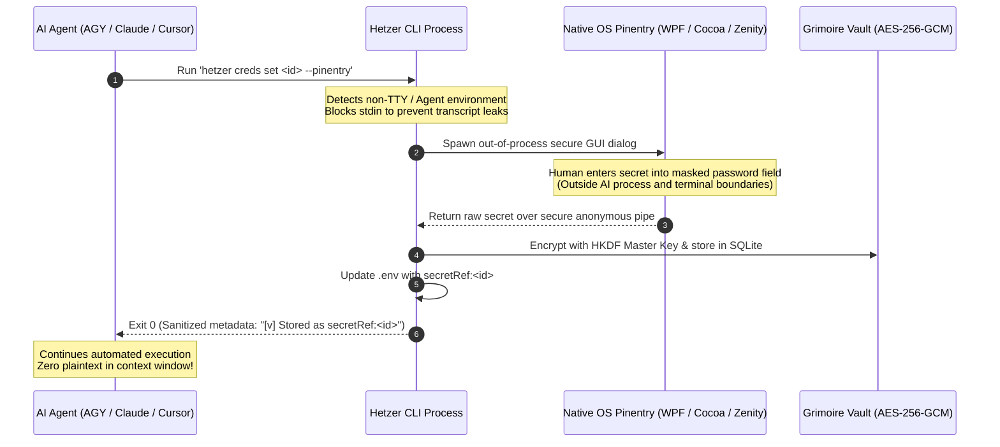

# RFC: Native OS Pinentry & GUI Masked Prompt Bridge for Autonomous Agent Runtimes

> **Document Status**: Approved Proposal / Architecture RFC (Targeting Hetzer v0.6.0+)  
> **Author**: Antigravity & Agung Gunawan  
> **Classification**: Agentic UX & Credential Safety Architecture (Defense-in-Depth)

---

## 1. Executive Summary & Problem Statement

### 1.1 The Agentic UX Friction
Autonomous AI agents (such as Google Antigravity/AGY, Claude Code, Cursor, OpenCode, and Hermes Agent) operate in continuous automated loops. When an agent determines that an integration requires a missing secret (e.g., `TELEGRAM_BOT_TOKEN`, `NPM_TOKEN`, or a private API key), current security constraints create significant workflow friction:

1. **Non-TTY Subprocess Execution**: Agent tool runners execute shell commands via piped subprocesses where `process.stdin.isTTY === false`.
2. **Intentional Agent Blocker**: Hetzer's core credential manager ([`cli/vault/creds.mjs`](file:///C:/Users/agung/AppData/Roaming/npm/node_modules/hetzer/cli/vault/creds.mjs)) strictly rejects non-interactive execution and actively detects agent runtimes (`ANTIGRAVITY_AGENT`, `CLAUDE_CODE`, `CURSOR_PROJECT_DIR`, `HERMES_AGENT`), blocking automated extraction or script injection.
3. **Strict Prohibition on CLI Arguments**: Passing raw secrets as command-line arguments (e.g., `hetzer creds set <id> <value>`) is intentionally forbidden to prevent token leakage into:
   - Shell history files (`.bash_history`, `ConsoleHost_history.txt`)
   - Host process tables (`ps aux`, Task Manager)
   - Agent transcript logs and model context windows
4. **Current Friction**: The developer is forced to interrupt their thought process, leave the agent IDE/terminal, open an independent OS terminal, execute `hetzer creds set <id>`, type the secret into the interactive masked prompt, and return to the agent.

---

## 2. The Proposed Solution: Native OS Pinentry Bridge

Instead of requiring an interactive terminal TTY or weakening Hetzer's defense-in-depth boundaries, Hetzer will incorporate an **Out-of-Process Native OS Pinentry Bridge**.

When `hetzer creds set <id>` is triggered inside an agent subprocess or headless harness:
1. Hetzer detects that `process.stdin.isTTY` is false and/or an agent environment variable is present.
2. Rather than aborting with an error, Hetzer spawns an **isolated native OS GUI modal dialog** on the user's desktop display.
3. The human user enters the credential into the native OS password box.
4. The raw secret is piped directly into Hetzer's memory, immediately encrypted into the AES-256-GCM Grimoire Vault (`hetzer-vault.db`), and committed as `secretRef:<id>`.
5. Hetzer returns exit code 0 to the AI agent with sanitized confirmation metadata.



---

## 3. Platform-Specific Pinentry Providers

Hetzer declares zero external runtime npm dependencies. The Pinentry Bridge uses lightweight native platform facilities already present in standard operating systems:

### 3.1 Windows (PowerShell / Win32 / WPF)
On Windows workstations, Hetzer invokes a lightweight PowerShell sub-process that renders a top-most, focused native password input window:

```powershell
Add-Type -AssemblyName PresentationFramework, System.Windows.Forms
[System.Windows.Forms.SendKeys]::SendWait("")
# Secure WPF PasswordBox Modal rendered in dedicated foreground window
```
- **Zero Disk Footprint**: Uses built-in Windows .NET presentation assemblies.
- **Window Isolation**: The input box runs as a separate GUI thread, stealing keyboard focus directly from the display server without passing keystrokes through the parent shell.

### 3.2 macOS (AppleScript / Cocoa)
On macOS workstations, Hetzer uses native System Events dialogs:

```bash
osascript -e 'display dialog "Enter secret value for \"'"$1"'\" (will be encrypted into Hetzer Grimoire Vault):" default answer "" with hidden answer with title "Hetzer Credential Safety Guard" with icon caution'
```
- **Secure by Default**: Keystrokes are masked with secure bullet points.
- **Keychain Parity**: Behaves identically to standard macOS system authentication dialogs.

### 3.3 Linux Workstations (X11 / Wayland)
On Linux desktop environments, Hetzer probes for standard system pinentry tools in order of preference:
1. `pinentry-gnome3` / `pinentry-gtk-2` / `pinentry-qt`
2. `zenity --password --title="Hetzer Vault"`
3. `kdialog --password "Hetzer Vault"`

### 3.4 Headless / Remote SSH Fallbacks (Cloud VPS)
When Hetzer detects that no graphical display is available (`DISPLAY` and `WAYLAND_DISPLAY` empty on Linux, or running in pure headless server environments):
1. **Loopback Web Token Receiver**: Hetzer starts a short-lived loopback HTTP listener on `127.0.0.1:<random-port>` with an ephemeral one-time authentication token, printing:
   ```text
   [!] Headless environment detected. Open this secure one-time URL to input credential:
       http://127.0.0.1:24819/input?token=f8a2...
   ```
2. **Terminal Direct Handoff**: Hetzer emits a clear notification instructing the user to connect to the host or execute `hetzer creds set` directly on the server console.

---

## 4. Security Invariants & Guarantees

This architecture preserves Hetzer's core security invariants:

1. **Zero Context Leakage (Invariant ZCL)**:
   - Keystrokes typed into the Pinentry modal dialog **never** traverse the stdout or stderr streams of the AI agent runner.
   - The agent's conversation trajectory JSONL log contains only the invocation `hetzer creds set <id>` and the non-sensitive success confirmation.
2. **No Command-Line Argument Snooping (Invariant NCL)**:
   - Secrets are never placed in `process.argv` or CLI arguments, preventing visibility in `ps aux`, `Get-Process`, or OS activity monitors.
3. **No Shell History Exposure (Invariant NSH)**:
   - Because no shell command containing the token is ever executed, shell history files (`.bash_history`, PowerShell PSReadLine) remain completely unpolluted.
4. **Audit Trail Accountability**:
   - Hetzer records a cryptographic audit log in the Grimoire Vault:
     `{ actor: "agent-pinentry-bridge", action: "vault.set-credential", source: "native-pinentry-gui", outcome: "allowed" }`

---

## 5. Implementation Roadmap (Target: Hetzer v0.6.0)

| Phase | Deliverable | Description |
| :--- | :--- | :--- |
| **Phase 1** | `cli/vault/pinentry.mjs` | Core cross-platform dispatcher probing OS GUI capabilities (`win32`, `darwin`, `linux`). |
| **Phase 2** | `cli/vault/creds.mjs` Update | Modify `setCredential` action: if `!input.isTTY`, automatically invoke Pinentry dispatcher before falling back to error. |
| **Phase 3** | Headless Loopback Broker | Add ephemeral loopback web prompt for remote VPS/SSH developers without X11 forwarding. |
| **Phase 4** | Verification Suite | Unit and end-to-end tests validating subprocess spawning, zero plaintext leakage, and AES-256-GCM vault persistence. |

---

## 6. Conclusion

By implementing the Native OS Pinentry Bridge, Hetzer bridges the gap between **uncompromised credential security** and **frictionless vibe coding**. Developers can instruct their AI agents to integrate new services, approve the native prompt with a single keystroke, and maintain absolute assurance that their plaintext secrets never enter model training sets or agent trajectory logs.
